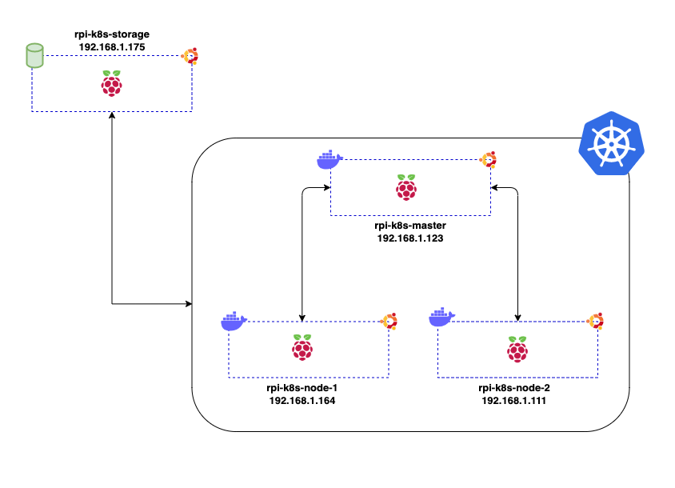
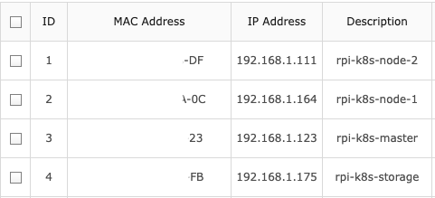
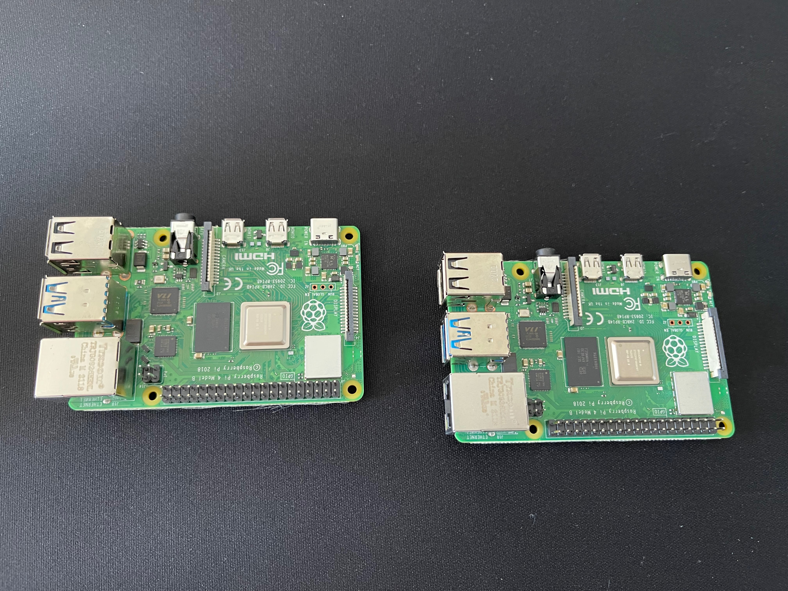

# Project: Kubernetes cluster using Raspberry Pi 4

> :warning: **I am still working on this project. I'll release the services as soon as it's done**

## Index

- [Hardware](#hardware)
- [Diagram](#diagram)
- [Requirements](#requirements)
- [Setting up](#setting-up)
  - [Ip Address ](#ip-address)
  - [Ansible hosts file](#ansible-hosts-file)
  - [Group Vars](#group-vars)
- [Services](#services)
- [Deploy](#deploy)
- [Images](#images)

## Hardware

- 4 Raspberry Pi 4, 4Gb each
- 4 Micro SDXC SanDisk 128Gb each (_I could use a smaller one, but this size was the same price as 64Gb_)
- 4 Cables Ugreen USB C to USB A
- 1 Micro-HDMI to standard HDMI
- 1 GeeekPi Rack Tower 4 Layer Acrylic Cluster Case Large Cooling Fan LED RGB Light.
- 1 Quick Charger 3.0, USB Plug Chargers, 33W Abetcabe 4 Ports USB

## Diagram



## Requirements

1. The first step is to install the OS, for this project I'd choose **Ubuntu Server 20.04.3 LTS**. Step by step is <a href=https://ubuntu.com/tutorials/how-to-install-ubuntu-on-your-raspberry-pi#1-overview> here</a>.

2. Install <a href="https://docs.ansible.com/ansible/latest/installation_guide/intro_installation.html#installing-ansible-on-macos">Ansible</a> on your local computer.

3. Install `sshpass` on MAC

```bash
brew install hudochenkov/sshpass/sshpass
```

## Setting up

### Ip Address

As specified on the <a href=https://ubuntu.com/tutorials/how-to-install-ubuntu-on-your-raspberry-pi#3-wifi-or-ethernet> official documentation</a>, we can set up the wifi connection by modifying the file `network-config`.

My cluster IP address.

| Hostname        | IP Address      |
| --------------- | --------------- |
| rpi-k8s-master  | `192.168.1.123` |
| rpi-k8s-node-1  | `192.168.1.111` |
| rpi-k8s-node-2  | `192.168.1.`    |
| rpi-k8s-storage | `192.168.1.175` |

Also, as I set up the Rpi to not use a static IP address, once the devices got the respective IPs, I bound this to each respective MAC Address on my router.



### Ansible hosts file

The Inventory hosts file needs to be updated with the Rpi Ip address.

The file is located at `/inventory/hosts`

```txt
[all:vars]
ansible_connection=ssh
ansible_user=ubuntu
ansible_ssh_pass=Y8WJq84Y #your ubuntu password

[master]
rpi-k8s-master  ansible_host=192.168.1.123

[nodes]
rpi-k8s-node-1  ansible_host=192.168.1.111

[storage]
rpi-k8s-storage  ansible_host=192.168.1.175
```

### Group Vars

This file contains information to be used on K8s services. Update it accordingly.

```yml
IpAddress:
  k8s_master: 192.168.1.123
  k8s_node_1: 192.168.1.111
  k8s_node_2: 192.168.1
  k8s_storage: 192.168.1.175

K8s:
  cluster_name: cluster-rpi-lessandro
  podSubnet: "10.244.0.0/16"
  version: 1.22.0-00 #Kubernetes version to be installed

AWS:
  HOSTED_ZONE_ID: ABCDE #Your Route53 Zone Id - K8s Dynamic DNS Services
  VPN_NAME: example.com #Your public record - K8s Dynamic DNS Services
  default_region: ap-southeast-2 #Your default AWS Region
```

### Services

> :warning: Make sure you read the documentation before deploying the services.

| Name                 | URL                         | Username | Password | Documentation                              |
| -------------------- | --------------------------- | -------- | -------- | ------------------------------------------ |
| Linkerd              | http://192.168.1.111:32100  | N/A      | N/A      | [link](roles/k8s/linkerd/README.md)        |
| Kubernetes Dashboard | https://192.168.1.111:32200 | N/A      | N/A      | [link](roles/k8s/dashboard/README.md)      |
| Dynamic DNS          | N/A                         | N/A      | N/A      | [link](roles/apps/dynamic-dns/README.md)   |
| Wireguard            | N/A                         | N/A      | N/A      | [link](roles/apps/wireguard/README.md)     |
| NFS Server           | N/A                         | N/A      | N/A      | [link](roles/apps/nfs-server/README.md)    |
| Jenkins & Trivy      | http://192.168.1.111:32000  | admin    | P@ssw0rd | [link](roles/apps/jenkins-trivy/README.md) |

### Deploy

Run the below Ansible playbook command.

```bash
ansible-playbook deploy
```

It'll deploy the services and applications specified on `deploy.yml` file.

### Images

**Raspberry Pi**





**Case**


