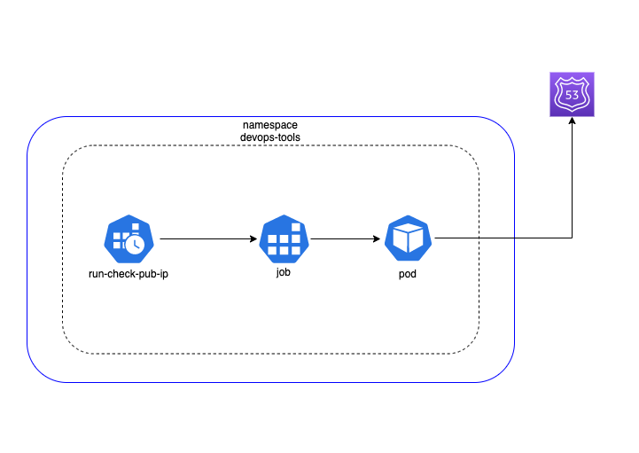

# Services: Dynamic DNS

## Index

- [Summary](#summary)
- [Requirements](#requirements)
- [Diagram](#diagram)

## Summary

This will deploy a dynamic service. A K8s cronjob will run every **5 min** to check your Public Ip address and then update your public record if there is any update.

## Requirements

Before deploying it, you need to create an IAM user with an access key. This access key will be used on the file `secret-k8s-iam.yml.j2`, update it accordingly.

You need to create a policy like below and attach it to this user, update the ARN zone id accordingly.

```json
{
  "Version": "2012-10-17",
  "Statement": [
    {
      "Effect": "Allow",
      "Action": [
        "route53:ChangeResourceRecordSets",
        "route53:ListResourceRecordSets"
      ],
      "Resource": ["arn:aws:route53:::hostedzone/Z1765566"]
    }
  ]
}
```

## Diagram


