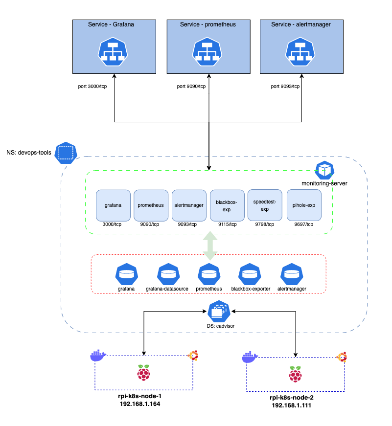
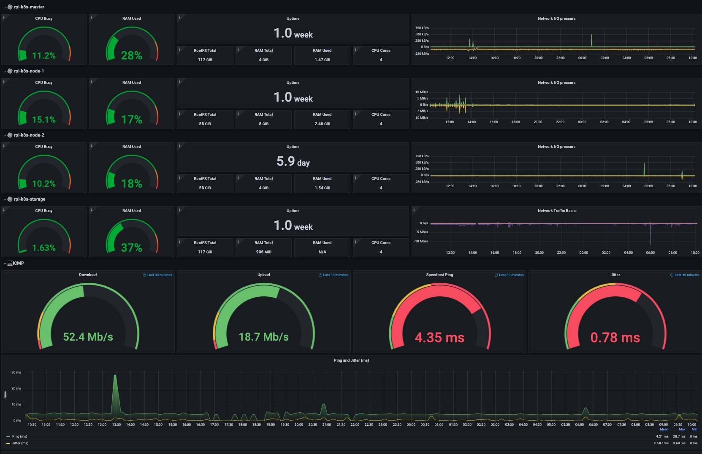

# Services: Monitoring

## Index

- [Summary](#summary)
- [Requirements](#requirements)
- [Diagram](#diagram)
- [Grafana Dashboard](#grafana-dashboard)
- [Prometheus Alert](#prometheus-alert)

## Summary

This deployment will set up Grafana, Prometheus, Alertmanager, Blackbox, Speedtest, Cadvisor and Pi-hole exporter.

- _Prometheus is a free software application used for event monitoring and alerting. It records real-time metrics in a time series database built using a HTTP pull model, with flexible queries and real-time alerting_

- _Grafana is a multi-platform open source analytics and interactive visualization web application. It provides charts, graphs, and alerts for the web when connected to supported data sources_

- _The Alertmanager handles alerts sent by client applications such as the Prometheus server_

- _The blackbox exporter allows blackbox probing of endpoints over HTTP, HTTPS, DNS, TCP and ICMP_

- _Speedtest measures the speed between your device and a test server, using your device's internet connection_

- _cAdvisor is an open source agent that monitors resource usage and analyzes the performance of containers._

- _PI-Hole exporter will export the metrics to Prometheus_

## Diagram



## Requirements

1. This deployment depends on [nfs-server](../nfs-server/README.md) deployment.
2. This deployment depends on [pihole](../pihole/README.md) deployment.

Update the var file `main.yml`, line 15, with the email's password.

The below data will be used to setup the `Prometheus Alert`

```yaml
gmail:
  SERVER: "smtp.gmail.com"
  PORT: 587
  FROM: "lessandro.ugulino@gmail.com" #your FROM email
  TO: "lezampieri@hotmail.com" #your TO email
  PWD: "xyz" #Your email password. More info https://support.google.com/mail/answer/185833?hl=en
```

Update the file `secret-pihole.yml.j2`, line 8, with preferred password.

```yaml
apiVersion: v1
kind: Secret
metadata:
  name: pihole-web-credentials
  namespace: devops-tools
type: Opaque
data:
  webpwd: "xyz" # echo -n "original-key" | base64
```

## Grafana Dashboard

You can import the dashboard I've created or customise your own.

**Import:**

1. Open your Grafana portal and go to the option of importing a dashboard.

2. Go to the “Upload JSON file” button, select the main.json in the `dashboard` folder.

3. Configure the fields according to your preferences and click on Import.

You should be able to see the dashboard similar as this one:



## Prometheus Alert

You can create yor own Prometheus rules or use the examples shown <a href=https://awesome-prometheus-alerts.grep.to/rules>here.</a>

There are some examples on the file `/files/alert-rules`
