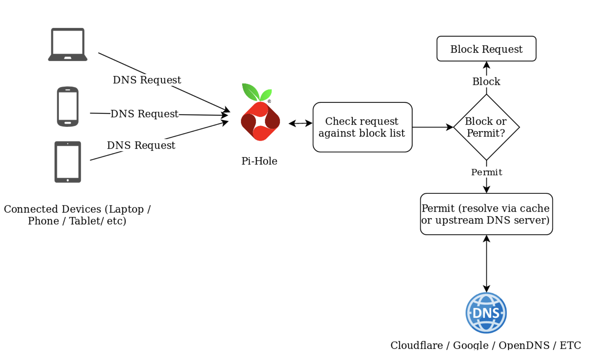
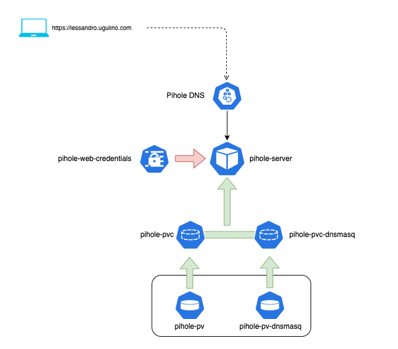
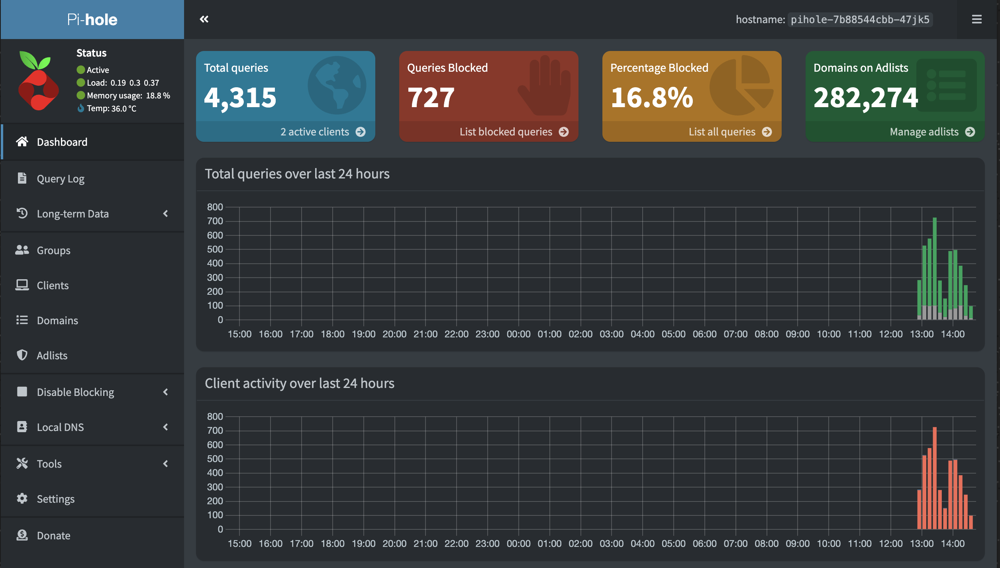

# Services: Pi-Hole

## Index

- [Summary](#summary)
- [Requirements](#requirements)
- [How to use Pi-Hole DNS Server on your routers](#how-to-use-pi-hole-dns-server-on-your-routers)
- [Access the Pi-hole dashboard](#access-the-pi-hole-dashboard)
- [Documentations](#documentations)

## Summary

This deployment will set up Pi-Hole.

_Pi-hole is a Linux network-level advertisement and Internet tracker blocking application which acts as a DNS sinkhole and optionally a DHCP server, intended for use on a private network_



## Requirements

1. This deployment depends on [nfs-server](../nfs-server/README.md) deployment.

Update the file `deploy-pihole.yml.j2`, line 117, with your Timezone.

```yaml
- name: TZ
  value: "Australia/Brisbane"
```

Update the file `secret-pihole.yml.j2`, line 8, with preferred password.

```yaml
data:
  webpwd: "abc" # echo -n "original-key" | base64
```



## How to use Pi-Hole DNS Server on your routers

On your router, you've to set the DNS primary server to the Pi-hole IP address.

example: <a href=https://www.tp-link.com/au/support/faq/3230/>How to use Pi-Hole DNS Server on TP-Link routers</a>

## Access the Pi-hole dashboard

Open the web broswer and go to `http://ip_node_01:8000/admin`, where the `ip_node_01` is the IP Address setup in the file `deploy.pihole.yml.j2` line `161`

Click on log-in and enter your password. You should now be in the Pi-hole admin panel



## Documentations

<a href=https://docs.pi-hole.net/main/basic-install/>Install</a>

<a href=https://docs.pi-hole.net/main/post-install/>Post-Install</a>

<a href=https://avoidthehack.com/best-pihole-blocklists>Avoid The Hack: The Best Pi-Hole Blocklists (2023)
</a>
