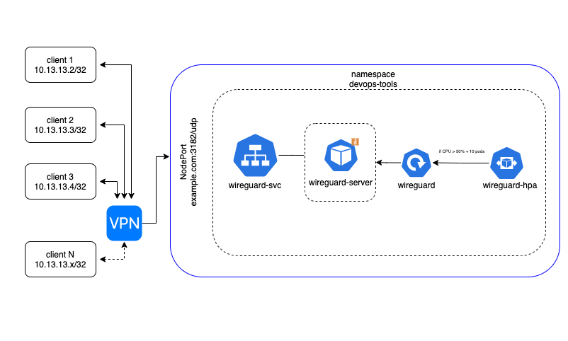
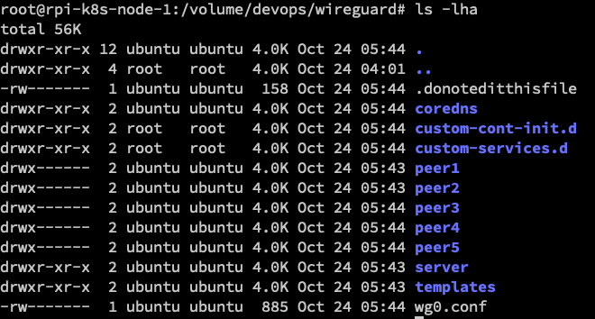
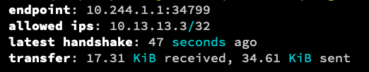

# Services: Wireguard

## Index

- [Summary](#summary)
- [Diagram](#diagram)
- [Requirements](#requirements)
- [Connect the client to the VPN](#connect-the-client-to-the-vpn)
- [Inspect config file](#inspect-config-file)

## Summary

This deployment will setup Wireguard VPN with autoscaling.

_WireGuard is a communication protocol and free and open-source software that implements encrypted virtual private networks, and was designed with the goals of ease of use, high speed performance, and low attack surface_

## Requirements

1. <a href=https://www.wireguard.com/install/>Wireguard applicaiton</a>

2. This deployment depends on [dynamic-dns](../dynamic-dns/README.md) deployment, because the **Wireguard** will use the domain name.

3. This deployment depends on [nfs-server](../nfs-server/README.md) deployment.

Update the file `deploy-wireguard.yml.j2` with your domain name.

```yaml
apiVersion: v1
kind: ConfigMap
metadata:
  name: wireguard-configmap
  namespace: devops-tools
data:
  PUID: "1000"
  PGID: "1000"
  TZ: "Australia/Sydney" # Your time zone
  SERVERPORT: "31820"
  SERVERURL: example.com # Your DNS name
  PEERS: "5" #How many client will be able to connect.
  PEERDNS: auto
  ALLOWEDIPS: "0.0.0.0/0, ::/0"
  INTERNAL_SUBNET: "10.13.13.0"
```



## Connect the client to the VPN

The first step is to access the peer created, you can either download it from the volume, in my case I'm not use an external storage and it's located on `rpi-k8s-node-1` at `/volume/devops/wireguard`.



You can access each `peer` folder and grep the `.conf`

**The easiet way to access the conf is via QR Code.**

**Option 1:**

Run `kubectl get pods -n devops-tools` to grep the wireguard pod name, in my case it's `wireguard-5fd8cbd895-szxfh`

Run `kubectl logs wireguard-5fd8cbd895-szxfh -n devops-tools`

This will output all peers QR Code.

**Option 2:**

Run `kubectl exec -ti wireguard-5fd8cbd895-szxfh -n devops-tools -- /app/show-peer 1`

## Inspect config file

You can run the command `kubectl exec -ti wireguard-5fd8cbd895-szxfh -n devops-tools -- wg` to show the tunnel interface. The wg utility provides a series of sub-commands for changing WireGuard-specific aspects of WireGuard interfaces.


