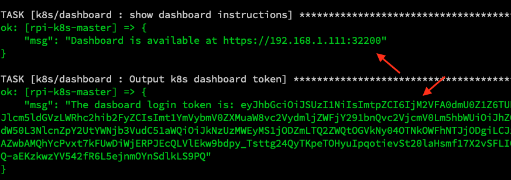
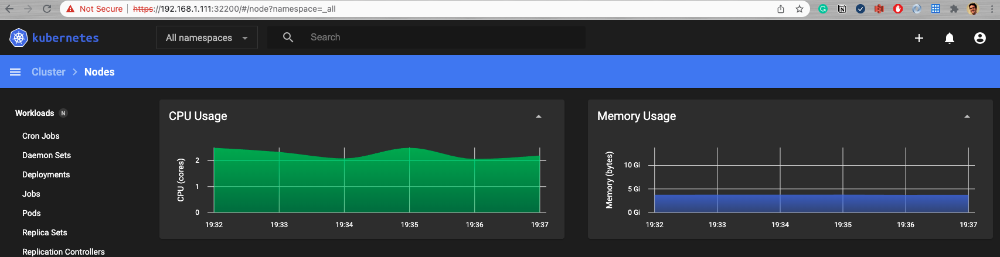
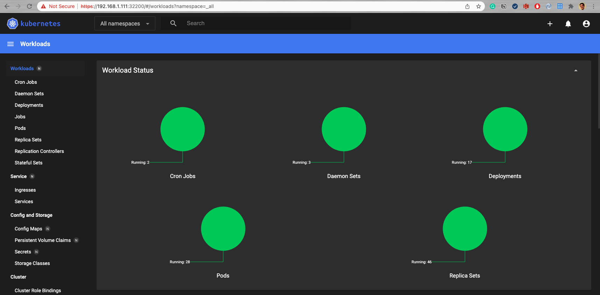

# Services: K8s Dashboard

## Index

- [Summary](#summary)
- [Instructions](#instructions)
- [Dashboard](#dashboard)

## Summary

This role will deploy <a href=https://github.com/kubernetes/dashboard>K8s dashboard</a>.

_Kubernetes Dashboard is a general purpose, web-based UI for Kubernetes clusters. It allows users to manage applications running in the cluster and troubleshoot them, as well as manage the cluster itself._

## Instructions

Basically, deploy the role `k8s/dashboard` and use the output message to access the dashboard portal, for example:

## Dashboard

